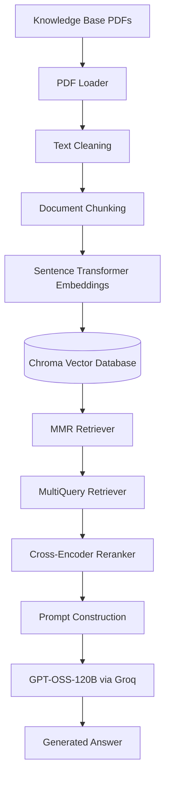

# Hyderabad Institute of Technology RAG Assistant

A Retrieval-Augmented Generation (RAG) system, delivered as a role-gated Streamlit app, that answers questions about a fictional university's policies from a live, editable knowledge base of PDF documents. Every answer is retrieved, reranked, and generated from the documents themselves — never from the model's own guesses — and an admin can add or remove source PDFs from the running app without touching the index.

## Overview

Large Language Models (LLMs) often struggle to answer questions about organization-specific information that exists only in private documents. Retrieval-Augmented Generation (RAG) addresses this by retrieving relevant information from a custom knowledge base before generating a response.

This project implements a RAG-based assistant for the fictional **Hyderabad Institute of Technology**, wrapped in a Streamlit interface with its own Admin/User access model — a deployable app, not just a backend script.

By combining document retrieval, cross-encoder reranking, and an LLM, the assistant generates accurate, context-aware responses grounded in the provided documents while reducing hallucinations.

## Features

- **Question Answering over Institutional Documents**  
  Answers university-related questions using information retrieved from a custom knowledge base rather than relying solely on the LLM's pre-trained knowledge.

- **Cross-Document Reasoning**  
  Answers compound questions that span more than one policy — e.g. attendance rules plus medical documentation, or library fines affecting internship NOC approval — by retrieving and reconciling passages from multiple documents at once.

- **Custom, Editable Knowledge Base**  
  Ships with **26 university policy documents** (~**185 pages**) covering admissions, academics, examinations, scholarships, placements, hostel policy, health services, transport, and more — and it isn't fixed, since PDFs can be added or removed from the running app.

- **Semantic Document Retrieval**  
  Retrieves the most relevant document sections using semantic similarity instead of keyword matching.

- **Maximum Marginal Relevance (MMR) Retrieval**  
  Balances relevance and diversity to reduce redundant retrieved context.

- **Multi-Query Retrieval**  
  Generates multiple variations of a user's query to improve retrieval for complex or ambiguous questions.

- **Cross-Encoder Reranking**  
  A `BAAI/bge-reranker-base` cross-encoder re-scores every candidate chunk against the actual question and keeps only the top 5, trimming the noise that multi-query expansion otherwise pulls into the context.

- **Persistent Vector Database**  
  Stores embeddings in a persistent Chroma database, committed to the repo, so nothing needs to be re-indexed on a fresh clone or deploy.

- **Incremental Knowledge Base Management**  
  PDFs can be added or deleted from the live index without a full rebuild. A SHA-256 content hash blocks duplicate uploads — renaming a file doesn't get it past the check.

- **Role-Based Access**  
  A session-only Admin/User picker gates the app on first load. Admin gets the full assistant plus the Manage PDFs tab; User gets ask-only access, no sign-in involved.

- **Grounded Response Generation**  
  Generates answers only from retrieved document context and returns a fallback response when information is unavailable.

- **Source Citations**  
  Displays the source documents used to generate each response, allowing users to trace answers back to the underlying knowledge base.    

- **Streamlit Web Interface**  
  About, Chat, and Contact pages behind a single sidebar nav, with a mobile-responsive sidebar toggle.

- **Automated Evaluation Pipeline**  
  Evaluates responses against a benchmark dataset of **50 university-related questions**.

- **Multiple Evaluation Methods**  
  Assesses response quality using **BERTScore** and **LLM-as-a-Judge** evaluation.

- **Modular Pipeline**  
  Separates document processing, vector storage, retrieval, reranking, and response generation for easier maintenance and extensibility.

## System Architecture

The system follows a Retrieval-Augmented Generation (RAG) pipeline that combines semantic search, cross-encoder reranking, and a Large Language Model. Documents are processed once and stored in a vector database at indexing time. When a user submits a query, the system retrieves candidate chunks, reranks them for relevance, constructs a context-aware prompt, and generates an answer using the retrieved information instead of relying solely on the LLM's internal knowledge.



## Project Workflow

The project operates in three stages: **Document Indexing**, **Knowledge Base Management**, and **Question Answering**.

### 1. Document Indexing

A one-time process performed when building the knowledge base from scratch.

- All PDF documents are loaded from the knowledge base.
- The extracted text is cleaned to remove unnecessary whitespace and formatting artifacts.
- Documents are split into overlapping chunks to preserve context while staying within the embedding model's input limits.
- Each chunk is converted into a vector embedding using the Sentence Transformer model.
- The generated embeddings are stored in a persistent Chroma vector database for efficient semantic retrieval.
- A populated database already ships in the repo, so this step only needs to run again to reset the index.

---

### 2. Knowledge Base Management

Ongoing, and available to the Admin role from inside the app — no script, no restart.

- A new PDF is uploaded from the Manage PDFs tab; its SHA-256 hash is checked against the store first, so the same document can never be indexed twice under a different filename.
- Accepted documents are chunked, embedded, and appended to the existing Chroma collection.
- Removing a document deletes every chunk carrying its hash from Chroma, then deletes the PDF itself from `knowledge_base/`.
- A User session can ask questions but doesn't see this tab at all — the knowledge base stays read-only for that role.

---

### 3. Question Answering

Executed whenever a user submits a query.

- The question is expanded into multiple variations using **MultiQuery Retriever** to improve document retrieval.
- The retriever searches the vector database using **Maximum Marginal Relevance (MMR)** to pull relevant and diverse chunks for each variation.
- A **cross-encoder reranker** scores every retrieved chunk against the original question and keeps the top 5 — this trimmed set, not the raw multi-query union, is what reaches the model.
- The retrieved context is combined with the user's question to construct the final prompt.
- The prompt is sent to the language model to generate an answer grounded in the retrieved documents.
- If the requested information is not available in the knowledge base, the system returns a fallback response instead of generating unsupported information.

## Knowledge Base

The knowledge base contains institutional documents for the fictional **Hyderabad Institute of Technology**, covering the following topics:

### Topics Covered

- Admissions & Cutoffs
- Credit System & Course Registration
- Examinations & Grading
- Attendance & Condonation
- Academic Probation & Detention
- Hostel Accommodation & Mess Policy
- Library Access & Fines
- Code of Conduct & Disciplinary Regulations
- Anti-Ragging & Student Safety
- Sports & Extracurricular Activities
- Placements & Training and Placement Cell
- Internships & No Objection Certificate (NOC)
- Alumni Network & Mentorship
- Entrepreneurship & Incubation
- Tuition Fees & Refund Policy
- Scholarships & Financial Aid
- IT Infrastructure & Wi-Fi Usage
- Research & Final Year Projects
- Grievance Redressal
- Convocation & Degree Requirements
- Campus Health Services & Medical Emergency Protocols
- International Exchange & Credit Transfer
- Student Council Constitution & Elections
- University Transport & Fleet Operations
- Green Campus, Sustainability & Waste Management
- Student Clubs, Cultural Fests & Event Sponsorship

## Technology Stack

| Category | Technology | Purpose |
|----------|------------|---------|
| Programming Language | Python | Core language used to develop the RAG pipeline. |
| Framework | LangChain | Orchestrates document processing, retrieval, prompt construction, and LLM interaction. |
| Document Loader | PyPDFLoader | Extracts text and metadata from PDF documents. |
| Text Splitting | RecursiveCharacterTextSplitter | Splits documents into overlapping chunks while preserving context. |
| Embedding Model | all-MiniLM-L6-v2 | Converts document chunks into dense vector embeddings for semantic search. |
| Vector Database | ChromaDB | Stores embeddings and enables persistent similarity search. |
| Retrieval Strategy | Maximum Marginal Relevance (MMR) | Retrieves relevant and diverse document chunks while reducing redundancy. |
| Query Enhancement | MultiQuery Retriever | Generates multiple variations of the user's query to improve retrieval performance. |
| Reranking | Cross-Encoder (`BAAI/bge-reranker-base`) | Re-scores retrieved chunks against the question and keeps only the most relevant before generation. |
| Large Language Model | GPT-OSS-120B (via Groq) | Generates responses using the retrieved document context. |
| Interface | Streamlit | Serves the About / Chat / Contact pages and the Admin/User role gate. |
| Access Control | Session-based role gate | Session-state Admin/User picker; no accounts, no database. |
| Evaluation | BERTScore, LLM-as-a-Judge | Evaluates response quality using semantic similarity and qualitative assessment. |

## Performance Evaluation

The RAG pipeline was evaluated using a manually created benchmark dataset consisting of **50 university-related questions**. Each question was paired with an expected answer to assess the system's retrieval and response generation capabilities. These figures were measured on the original 20-document knowledge base, before the cross-encoder reranker was added — they describe the pipeline's baseline accuracy rather than its current configuration.

To obtain a more comprehensive assessment, the project was evaluated using two complementary approaches:

### BERTScore

The generated answers were compared against the reference answers using BERTScore.

| Metric | Score |
| :------ | ----: |
| Precision | **0.8768** |
| Recall | **0.9322** |
| F1 Score | **0.9035** |

These results indicate a high degree of semantic similarity between the generated responses and the expected answers.

---

### LLM-as-a-Judge

An independent language model was used to evaluate every generated response against its corresponding reference answer.

Each response was assessed on the following criteria:

- Correctness
- Completeness
- Faithfulness (Hallucination)
- Overall Quality

#### Average Scores

| Metric | Score |
| :------ | ----: |
| Correctness | **9.60 / 10** |
| Completeness | **9.38 / 10** |
| Faithfulness | **9.92 / 10** |
| Overall | **9.63 / 10** |

#### Overall Results

| Metric | Value |
| :------ | ----: |
| Evaluation Questions | **50** |
| Fully Correct Responses | **45** |
| Partially Correct Responses | **3** |
| No Answer | **2** |
| Strict Accuracy | **90%** |
| Lenient Accuracy | **93%** |

The combination of automated metrics and LLM-based evaluation provides a balanced assessment of both semantic accuracy and overall response quality.

## Future Improvements

- **Hybrid Search**  
  Combine semantic retrieval with keyword-based search to improve retrieval for queries where exact terms, names, or identifiers matter.

- **Improved Chunk Quality & Deduplication**  
  Reduce duplicate or noisy chunks entering the final context. Some redundancy and irrelevant content can still remain even after cross-encoder reranking, so future work will explore better chunk deduplication and noise filtering.

- **Expanded Evaluation**  
  Strengthen the evaluation pipeline by expanding LLM-based evaluation and introducing retrieval-specific metrics such as **Recall@K** and **Precision@K** to evaluate retrieval quality independently from answer generation.

## Project Structure

```text
University-RAG/
│
├── knowledge_base/
│   └── 26 PDF documents forming the university knowledge base
│
├── chroma_db/
│   └── Persistent Chroma vector database (committed — no rebuild needed on clone)
│
├── archives/
│   ├── rag_pipeline.ipynb
│   │   └── Development notebook used for experimentation and evaluation
│   ├── evaluation2.csv
│   │   └── Benchmark dataset containing questions
│   ├── evaluation_answer.csv
│   │   └── Generated answers produced by the RAG system
│   └── LLM_Judge_Evaluation_Report.xlsx
│       └── Results of the LLM-as-a-Judge evaluation
│
├── UI.py
│   └── Streamlit front end — About / Chat / Contact pages, role gate, PDF upload & delete
│
├── app.py
│   └── Runs the RAG pipeline — retrieval, reranking, and answer generation
│
├── create_db.py
│   └── Builds the vector database from scratch from the PDFs in knowledge_base/
│
├── add_document.py
│   └── Adds a single PDF to the existing index without a rebuild
│
├── delete_document.py
│   └── Removes a PDF and its chunks from the index
│
├── requirements.txt
│   └── Project dependencies
│
├── .env.example
│   └── Template for the required GROQ_API_KEY
│
├── .devcontainer/
│   └── Config for GitHub Codespaces / dev containers
│
├── LICENSE
│   └── MIT License
│
├── .env
│   └── Stores API keys (not included in the repository)
│
├── .gitignore
│
└── README.md
```

## Installation

### 1. Clone the Repository

```bash
git clone https://github.com/Tanishk-2004/University-RAG.git

cd University-RAG
```

---

### 2. Create a Virtual Environment

```bash
python -m venv .venv
```

Activate the virtual environment.

**Windows**

```bash
.venv\Scripts\activate
```

**macOS / Linux**

```bash
source .venv/bin/activate
```

---

### 3. Install the Required Dependencies

```bash
pip install -r requirements.txt
```

---

### 4. Configure Environment Variables

Copy the example file and add your Groq API key.

```bash
cp .env.example .env
```

```env
GROQ_API_KEY=your_api_key_here
```

---

### 5. Vector Database — Already Built

A populated `chroma_db/` is committed to the repo and indexed against everything currently in `knowledge_base/`, so a fresh clone can skip straight to step 6. Only rebuild it if you want to reset the index from scratch:

```bash
python create_db.py
```

**Note:** This overwrites the existing collection, and the `persist_directory` and `collection_name` configured in `create_db.py` must match the values used in `app.py` — if they differ, the application won't be able to load the database.

---

### 6. Run the Application

```bash
streamlit run UI.py
```

The app opens at `localhost:8501`. The first screen asks you to continue as **Admin** (full access, including adding/removing PDFs) or **User** (ask-only) — a session-only choice with no sign-in involved. On the first question asked, the app also downloads the `BAAI/bge-reranker-base` reranker model from Hugging Face alongside the embedding model, so the first response may take a little longer than the rest.
