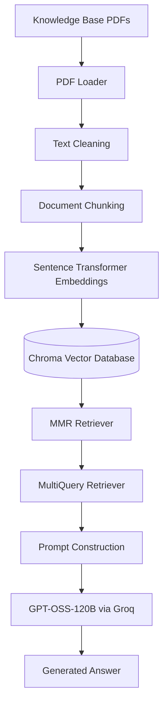

# Hyderabad Institute of Technology RAG Assistant

A Retrieval-Augmented Generation (RAG) system that answers university-related questions using a custom knowledge base of institutional documents. The assistant retrieves relevant information from the knowledge base before generating a response, helping reduce hallucinations and produce answers grounded in the provided documents.

## Overview

Large Language Models (LLMs) can answer a wide range of questions, but they often struggle with information that is specific to an organization or exists only in private documents. Since this information is not part of the model's training data, responses may be incomplete or inaccurate.

This project addresses that challenge by implementing a Retrieval-Augmented Generation (RAG) system for a fictional university, **Hyderabad Institute of Technology**. Instead of relying only on the model's internal knowledge, the system retrieves relevant information from a custom knowledge base before generating a response.

The knowledge base contains **20 university policy documents** spanning approximately **180 pages** and covers academic regulations, admissions, examinations, scholarships, placements, hostel policies, and other institutional information. By combining document retrieval with an LLM, the assistant generates responses that are grounded in the provided documents while reducing the likelihood of hallucinations.

## Features

- **Question Answering over Institutional Documents**  
  Answers university-related questions using information retrieved from a custom knowledge base instead of relying solely on the LLM's pre-trained knowledge.

- **Custom Knowledge Base**  
  Built on a collection of 20 university documents covering approximately 180 pages of academic policies, regulations, and administrative procedures.

- **Semantic Document Retrieval**  
  Retrieves relevant document sections based on semantic similarity rather than simple keyword matching, improving the relevance of retrieved context.

- **Maximum Marginal Relevance (MMR) Retrieval**  
  Balances relevance and diversity while retrieving document chunks, helping reduce redundant context.

- **Multi-Query Retrieval**  
  Automatically generates multiple variations of the user's question to improve retrieval performance for complex or ambiguous queries.

- **Persistent Vector Database**  
  Stores document embeddings in a persistent Chroma database, eliminating the need to recreate embeddings every time the application starts.

- **Grounded Response Generation**  
  Generates answers using only the retrieved document context and returns an appropriate fallback response when the required information is unavailable.

- **Automated Evaluation Pipeline**  
  Evaluates generated responses against reference answers using a predefined dataset of 50 university-related questions.

- **Multiple Evaluation Methods**  
  Measures response quality using both BERTScore and an independent LLM-as-a-Judge evaluation to assess semantic accuracy and overall answer quality.

- **Modular Pipeline**  
  Separates document processing, vector database creation, retrieval, response generation, making the system easier to maintain and extend.

  ## System Architecture

The system follows a Retrieval-Augmented Generation (RAG) pipeline that combines semantic search with a Large Language Model. Documents are first processed and stored in a vector database during the indexing phase. When a user submits a query, the system retrieves the most relevant document chunks, constructs a context-aware prompt, and generates an answer using the retrieved information instead of relying solely on the LLM's internal knowledge.


## Project Workflow

The project operates in two stages: **Document Indexing** and **Question Answering**.

### 1. Document Indexing

This is a one-time process performed when creating or updating the knowledge base.

- All PDF documents are loaded from the knowledge base.
- The extracted text is cleaned to remove unnecessary whitespace and formatting artifacts.
- Documents are split into overlapping chunks to preserve context while staying within the embedding model's input limits.
- Each chunk is converted into a vector embedding using the Sentence Transformer model.
- The generated embeddings are stored in a persistent Chroma vector database for efficient semantic retrieval.

---

### 2. Question Answering

This process is executed whenever a user submits a query.

- The user's question is expanded into multiple variations using **MultiQuery Retriever** to improve document retrieval.
- The retriever searches the vector database using **Maximum Marginal Relevance (MMR)** to retrieve relevant and diverse document chunks.
- The retrieved context is combined with the user's question to construct the final prompt.
- The prompt is sent to the language model to generate an answer grounded in the retrieved documents.
- If the requested information is not available in the knowledge base, the system returns a fallback response instead of generating unsupported information.

## Knowledge Base

The RAG system is built on a custom knowledge base created specifically for this project. It consists of **20 PDF documents** containing approximately **180 pages** of institutional information for the fictional **Hyderabad Institute of Technology**.

The documents simulate real university policies and administrative guidelines, allowing the assistant to answer questions across a wide range of academic and campus-related topics.

### Topics Covered

- Admissions & Cutoffs
- Credit System & Course Registration
- Examinations & Grading
- Attendance & Condonation
- Academic Probation & Detention
- Hostel & Mess Policy
- Library Rules & Fines
- Code of Conduct & Discipline
- Anti-Ragging & Student Safety
- Sports & Student Clubs
- Placements & Training and Placement Cell
- Internships & No Objection Certificate (NOC)
- Alumni & Mentorship
- Entrepreneurship & Incubation
- Tuition Fees & Refund Policy
- Scholarships & Financial Aid
- IT Services & Wi-Fi Usage
- Research & Final Year Projects
- Grievance Redressal
- Convocation & Graduation

The knowledge base serves as the single source of truth for the system. Every response is generated using information retrieved from these documents rather than relying solely on the language model's internal knowledge.

## Technology Stack

| Category | Technology | Purpose |
|----------|------------|---------|
| Programming Language | Python | Core language used to develop the RAG pipeline. |
| Framework | LangChain | Orchestrates document processing, retrieval, prompt construction, and LLM interaction. |
| Document Loader | PyPDFLoader | Extracts text and metadata from PDF documents. |
| Text Splitting | RecursiveCharacterTextSplitter | Splits documents into overlapping chunks while preserving context. |
| Embedding Model | all-MiniLM-L6-v2 | Converts document chunks into dense vector embeddings for semantic search. |
| Vector Database | ChromaDB | Stores embeddings and enables persistent similarity search. |
| Retrieval Strategy | Maximum Marginal Relevance (MMR) | Retrieves relevant and diverse document chunks while reducing redundancy. |
| Query Enhancement | MultiQuery Retriever | Generates multiple variations of the user's query to improve retrieval performance. |
| Large Language Model | GPT-OSS-120B (via Groq) | Generates responses using the retrieved document context. |
| Evaluation | BERTScore, LLM-as-a-Judge | Evaluates response quality using semantic similarity and qualitative assessment. 

## Performance Evaluation

The RAG pipeline was evaluated using a manually created benchmark dataset consisting of **50 university-related questions**. Each question was paired with an expected answer to assess the system's retrieval and response generation capabilities.

To obtain a more comprehensive assessment, the project was evaluated using two complementary approaches:

- **BERTScore**, which measures the semantic similarity between the generated answers and the expected answers.
- **LLM-as-a-Judge**, where an independent language model evaluates each response for correctness, completeness, faithfulness, and overall quality.

### BERTScore

The generated answers were compared against the reference answers using BERTScore.

| Metric | Score |
| :------ | ----: |
| Precision | **0.8768** |
| Recall | **0.9322** |
| F1 Score | **0.9035** |

These results indicate a high degree of semantic similarity between the generated responses and the expected answers.

---

### LLM-as-a-Judge

An independent language model was used to evaluate every generated response against its corresponding reference answer.

Each response was assessed on the following criteria:

- Correctness
- Completeness
- Faithfulness (Hallucination)
- Overall Quality

#### Average Scores

| Metric | Score |
| :------ | ----: |
| Correctness | **9.60 / 10** |
| Completeness | **9.38 / 10** |
| Faithfulness | **9.92 / 10** |
| Overall | **9.63 / 10** |

#### Overall Results

| Metric | Value |
| :------ | ----: |
| Evaluation Questions | **50** |
| Fully Correct Responses | **45** |
| Partially Correct Responses | **3** |
| No Answer | **2** |
| Strict Accuracy | **90%** |
| Lenient Accuracy | **93%** |

The combination of automated metrics and LLM-based evaluation provides a balanced assessment of both semantic accuracy and overall response quality.

## Project Structure

```text
hyderabad-institute-rag/
│
├── Knowledge_base/
│   └── 20 PDF documents forming the university knowledge base
│
├── chroma_db/
│   └── Persistent Chroma vector database
│
├── app.py
│   └── Runs the RAG pipeline and answers user queries
│
├── create_db.py
│   └── Creates the vector database from the PDF documents
│
├── notebook.ipynb
│   └── Development notebook used for experimentation and evaluation
│
├── evaluation2.csv
│   └── Benchmark dataset containing questions
│
├── evaluation_answer.csv
│   └── Generated answers produced by the RAG system
│
├── LLM_Judge_Evaluation_Report.xlsx
│   └── Results of the LLM-as-a-Judge evaluation
│
├── requirements.txt
│   └── Project dependencies
│
├── .env
│   └── Stores API keys (not included in the repository)
│
├── .gitignore
│
└── README.md
```

## Installation

### 1. Clone the Repository

```bash
git clone https://github.com/Tanishk-2004/hyderabad-institute-rag.git

cd hyderabad-institute-rag
```

---

### 2. Create a Virtual Environment

```bash
python -m venv .venv
```

Activate the virtual environment.

**Windows**

```bash
.venv\Scripts\activate
```

**macOS / Linux**

```bash
source .venv/bin/activate
```

---

### 3. Install the Required Dependencies

```bash
pip install -r requirements.txt
```

---

### 4. Configure Environment Variables

Create a `.env` file in the project root and add your Groq API key.

```env
GROQ_API_KEY=your_api_key_here
```

---

### 5. Build the Vector Database

Before running the application for the first time, create the vector database from the PDF documents.

```bash
python create_db.py
```

This step only needs to be performed once or whenever the knowledge base is updated.

---

### 6. Run the Application

```bash
python app.py
```

The assistant is now ready to answer questions using the university knowledge base.